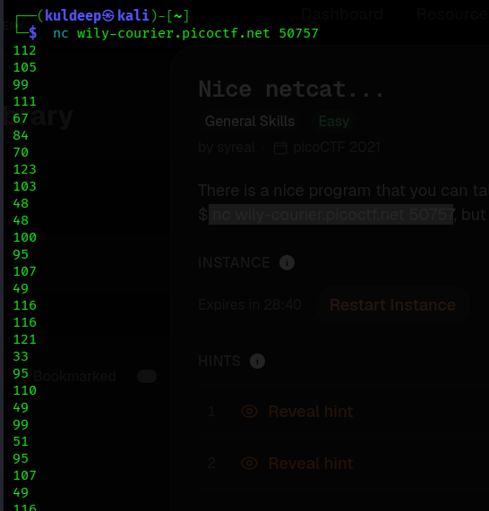
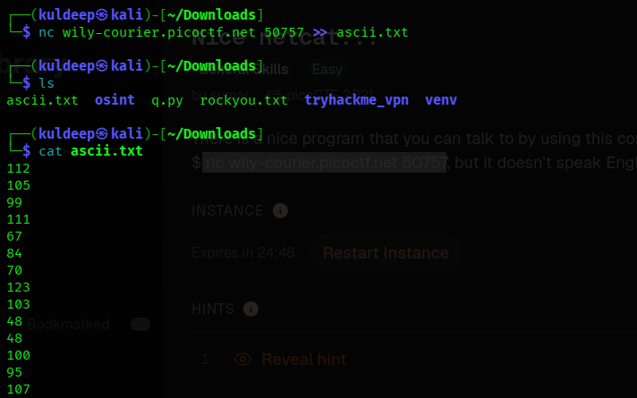
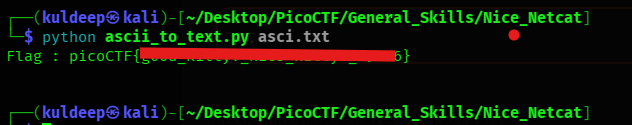

# Challenge Solution – ASCII to Text Conversion

## Challenge Overview

In this challenge, we were provided with a network service that could be accessed using the following command:

```bash
$ nc wily-courier.picoctf.net 50757
```

After connecting to the server, a sequence of ASCII numbers was displayed. The objective was to convert these ASCII values into readable text and obtain the flag.

---

## Step 1: Connect to the Server

I first connected to the challenge server using the `nc` (Netcat) command:

```bash
$ nc wily-courier.picoctf.net 50757
```

After successfully connecting to the server, it returned a large sequence of ASCII numbers.



The output consisted of numerical ASCII values representing characters. Manually converting all of these values would be time-consuming, so I decided to save the output into a file and automate the conversion using Python.

---

## Step 2: Save the ASCII Values

To store the ASCII output received from the server in a file named **`ascii.txt`**, I used the following command:

```bash
$ nc wily-courier.picoctf.net 50757 >> ascii.txt
```

The `>>` operator redirects the output of the Netcat command and appends it to the specified file.

The received ASCII values were successfully stored in **`ascii.txt`**.



---

## Step 3: Convert ASCII Values to Text

After saving the ASCII values, I created a Python script named **`ascii_to_text.py`** to convert the ASCII numbers into their corresponding characters.

### `ascii_to_text.py`

```python
import sys

# Ensure a file argument was provided to prevent an IndexError
if len(sys.argv) < 2:
    print("Error: Please provide an input file path.")
    print("Usage: python script.py <filename>")
    sys.exit(1)

file = sys.argv[1]

# 1. FIX: Initialize flag as an empty string instead of None
flag = ""

with open(file, 'r', encoding='utf-8') as files:
    for lines in files:
        clean_line = lines.rstrip("\n")        
        # Skip empty lines to prevent int() conversion errors
        if not clean_line:
            continue
        # 2. Convert ASCII number to character and append it to the string
        flag = flag + chr(int(clean_line))
print("Flag :", flag)
```

The script performs the following operations:

1. Takes the input filename from the command-line argument.
2. Reads the contents of `ascii.txt`.
3. Splits the ASCII values into individual numbers.
4. Converts each ASCII number into its corresponding character using Python's `chr()` function.
5. Combines all the characters to reconstruct the original text.
6. Prints the resulting text to the terminal.

---

## Step 4: Run the Conversion Script

I executed the Python script by providing `ascii.txt` as the input file:

```bash
$ python ascii_to_text.py ascii.txt
```

The script successfully converted the ASCII values into readable text.



The output contained the required flag.

---

## Step 5: Result

The ASCII values received from the challenge server were successfully converted into their corresponding text using the Python script.

### Flag

```text
[FLAG_OBTAINED_FROM_OUTPUT]
```


---

## Conclusion

The challenge was solved by connecting to the provided Netcat service and capturing the returned ASCII values into a file. A Python script was then used to convert each ASCII value into its corresponding character. The resulting text revealed the required flag.

### Files Used

```text
.
├── ascii.txt
├── ascii_to_text.py
├── screenshot-1.png
├── screenshot-2.png
├── screenshot-3.png
└── report.md
```
