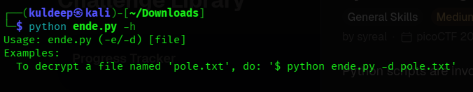
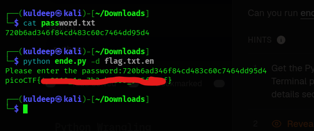

# Challenge Solution – Encryption and Decryption

## Challenge Overview

In this challenge, three files were provided:

1. **`ende.py`** – A Python script used for both encryption and decryption. The required operation is selected using command-line flags.
2. **`flag.txt.en`** – The encrypted flag file that needs to be decrypted.
3. **`password.txt`** – A file containing the password required for the encryption/decryption process.

---

## Step 1: Understanding `ende.py`

To understand how the `ende.py` script works and identify the available command-line options, I first used the `-h` (help) flag:

```bash
$ python ende.py -h
```

The command displayed the usage information and the available options supported by the script.



From the help information, I determined that the script supports a decryption option using the `-d` flag.

---

## Step 2: Decrypting the Flag

The encrypted flag was stored in the file **`flag.txt.en`**.

To decrypt this file, I executed the following command:

```bash
$ python ende.py -d flag.txt.en
```

After executing the command, the script prompted me to enter the password required for decryption.

The required password was available in **`password.txt`**, so I copied the password from that file and entered it when prompted.

After providing the correct password, the script successfully decrypted the encrypted file and displayed the original flag as the output.



---

## Step 3: Result

The encrypted flag was successfully decrypted using the `ende.py` script and the password provided in `password.txt`.

### Flag

```text
[FLAG_OBTAINED_FROM_OUTPUT]
```

> Replace `[FLAG_OBTAINED_FROM_OUTPUT]` with the actual flag obtained during the challenge.

---

## Conclusion

The challenge was solved by first examining the available options of `ende.py` using the `-h` flag. The `-d` option was then used to decrypt `flag.txt.en`. By providing the password stored in `password.txt`, the encrypted file was successfully decrypted and the flag was obtained.

### Files Used

```text
.
├── ende.py
├── flag.txt.en
├── password.txt
├── screenshot-1.png
├── screenshot-2.png
└── report.md
```
